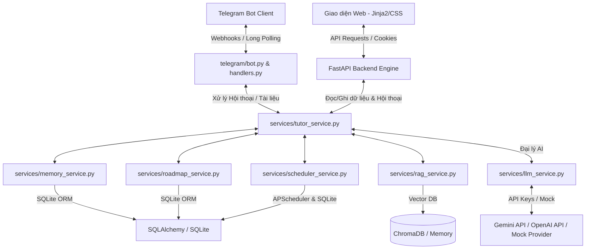
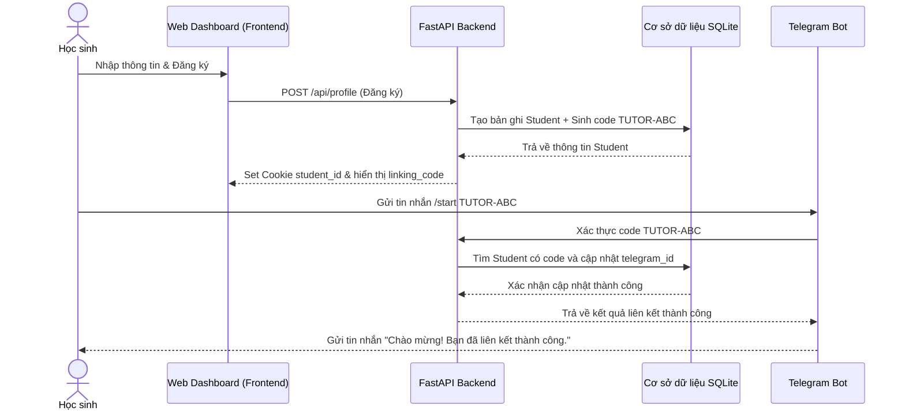
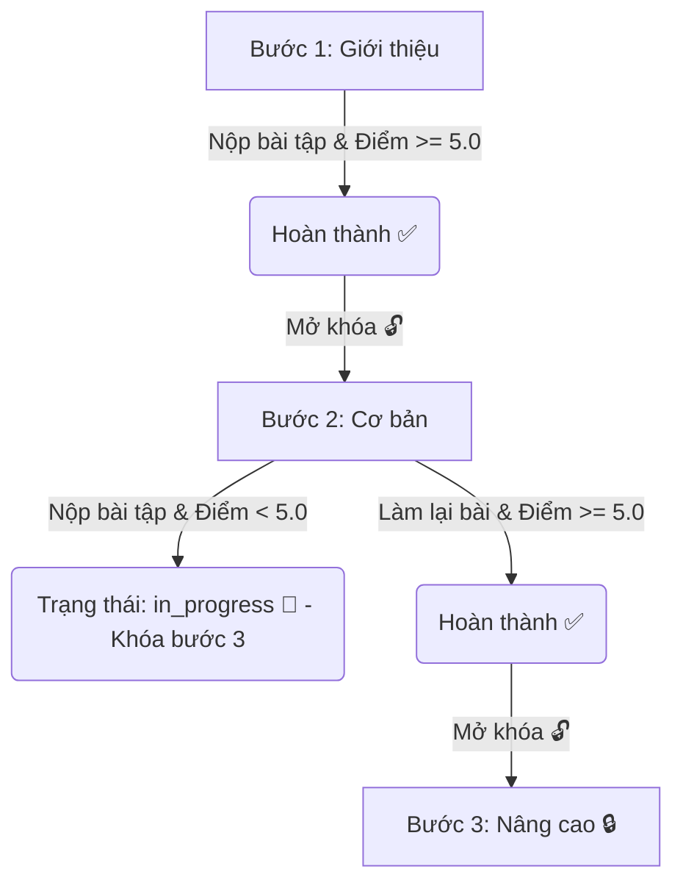

# 🎓 AI Tutor Platform MVP - Giới thiệu Chi tiết Hệ thống & Luồng hoạt động

Chào mừng bạn đến với tài liệu giới thiệu chi tiết về hệ thống **AI Tutor Platform MVP**. Đây là một nền tảng Gia sư Trí tuệ Nhân tạo tinh gọn nhưng toàn diện, hỗ trợ học tập cá nhân hóa thông qua việc kết hợp công nghệ AI tạo sinh (Generative AI), hệ thống tìm kiếm tăng cường RAG, quản lý lộ trình học tập, tự động giao bài tập và đồng bộ hóa đa kênh (Web App & Telegram Bot).

---

## 🗺️ Sơ đồ Tổng quan Hệ thống (System Architecture)

Hệ thống hoạt động theo mô hình **Service-Based Architecture** (Kiến trúc Hướng Dịch vụ) rõ ràng, giúp tránh nhập nhằng và hỗ trợ khả năng mở rộng. Dưới đây là cách các thành phần tương tác:



---

## 📁 Cấu trúc thư mục & Vai trò Thành phần

```text
ai_tutor/
├── backend/
│   ├── main.py                  # Điểm khởi chạy FastAPI, tích hợp Telegram Bot & APScheduler
│   ├── api/                     # Các router phân phối API endpoints
│   │   ├── chat.py              # Xử lý hội thoại của học sinh, tải lịch sử chat
│   │   ├── upload.py            # Tải lên tài liệu học tập và lập chỉ mục RAG
│   │   ├── roadmap.py           # Tạo lộ trình học tập, mở khóa và đồng bộ tiến độ
│   │   ├── profile.py           # Quản lý hồ sơ học sinh (mục tiêu, trình độ, lịch bài tập)
│   │   └── scheduler.py         # Cấu hình lịch bài tập tự động và tính toán tiến độ
│   ├── services/                # Tầng nghiệp vụ chứa logic chính (Business Logic)
│   │   ├── global_services.py   # Quản lý các biến singleton dùng chung (tránh Circular Import)
│   │   ├── tutor_service.py     # Điều phối hội thoại, phân tích ý định (Intent parsing), chấm điểm bài tập
│   │   ├── llm_service.py       # Tích hợp và gọi các mô hình Gemini, OpenAI hoặc Mock Offline
│   │   ├── rag_service.py       # Tách nhỏ văn bản (Chunking) và quản lý Vector Database (ChromaDB)
│   │   ├── memory_service.py    # Quản lý lịch sử hội thoại
│   │   ├── roadmap_service.py   # Sinh lộ trình học bằng AI dựa trên mục tiêu
│   │   └── scheduler_service.py # Lên lịch chạy APScheduler, tự động giao bài tập & gửi báo cáo đánh giá
│   ├── database/                # Quản lý cơ sở dữ liệu
│   │   ├── db.py                # Cấu hình SQLAlchemy & Kết nối SQLite
│   │   └── models.py            # Định nghĩa các bảng (Student, ChatMessage, Document, Roadmap, Progress, HomeworkSubmission, ScheduledJob)
│   ├── telegram/                # Tích hợp Telegram Bot
│   │   ├── bot.py               # Khởi tạo Telegram Bot và phương thức gửi tin nhắn
│   │   └── handlers.py          # Lắng nghe tin nhắn chat, nhận file tài liệu, xử lý lệnh /start, /link
│   └── storage/                 # Thư mục lưu trữ tệp tin tải lên và file DB SQLite
├── frontend/                    # Giao diện người dùng
│   ├── templates/
│   │   ├── onboarding.html      # Giao diện Đăng ký / Đăng nhập nhanh
│   │   └── dashboard.html       # Bảng điều khiển học tập Glassmorphism đa năng
│   └── static/
│       └── css/
│           └── style.css        # Hệ thống thiết kế UI/UX cao cấp
```

---

## 🛠️ Chi tiết các Chức năng & Cơ chế Hoạt động

### 1. Đăng ký & Đồng bộ Đa kênh (Onboarding & Sync)
*   **Cách hoạt động**:
    1.  Học sinh truy cập Web, đăng ký bằng **Tên** và **Email**. Hệ thống sẽ tạo một dòng mới trong bảng `Student` và cấp một mã liên kết duy nhất (`linking_code`) có dạng `TUTOR-XXXXXX`.
    2.  Hệ thống lưu trạng thái đăng nhập thông qua Cookie `student_id`.
    3.  Để đồng bộ với Telegram, học sinh tìm Bot Telegram của hệ thống và gửi lệnh: `/start TUTOR-XXXXXX` (hoặc `/link TUTOR-XXXXXX`).
    4.  Bot kiểm tra mã liên kết trong cơ sở dữ liệu, nếu khớp sẽ cập nhật trường `telegram_id` của học sinh đó.
    5.  **Kết quả**: Kể từ giây phút này, toàn bộ lịch sử chat, bài tập về nhà, tài liệu học tập đều được đồng bộ thời gian thực giữa Web và Telegram.



---

### 2. Trò chuyện và Nhận diện Ý định tự động (AI Chat Hub & Intent Parsing)
*   **Cách hoạt động**:
    *   Mỗi khi học sinh nhắn tin (trên Web hoặc Telegram), hệ thống sẽ:
        1.  Tải thông tin hồ sơ của học sinh (Tên, trình độ, mục tiêu học tập, lịch bài tập).
        2.  Lấy 10 tin nhắn gần nhất từ `MemoryService` để duy trì ngữ cảnh.
        3.  Gọi `RAGService` để lấy tài liệu tham khảo liên quan (nếu có).
        4.  Gửi toàn bộ thông tin trên vào System Prompt của AI.
    *   Hệ thống ép buộc AI trả về kết quả dưới định dạng **JSON** thuần túy có cấu trúc:
        ```json
        {
          "reply": "Nội dung phản hồi bằng tiếng Việt...",
          "action": {
            "type": "Tên_Hành_Động",
            "params": { ... }
          }
        }
        ```
    *   Các hành động (`action`) được hỗ trợ tự động nhận diện trực tiếp qua ngôn ngữ tự nhiên:
        *   `generate_roadmap`: Khi học sinh yêu cầu học một môn học mới (ví dụ: *"lập lộ trình học SQL"*).
        *   `schedule_homework`: Khi học sinh yêu cầu lên lịch bài tập (ví dụ: *"giao bài Python sau 1 phút"*).
        *   `update_profile`: Khi học sinh muốn cập nhật thông tin hoặc lịch học tự động (ví dụ: *"giao bài tập lúc 8h tối hàng ngày"*).
        *   `grade_homework`: Khi học sinh gửi câu trả lời bài tập về nhà (hệ thống tự động phát hiện câu trả lời và kích hoạt chấm điểm).

---

### 3. Tìm kiếm Tài liệu Thông minh (RAG - Retrieval-Augmented Generation)
*   **Cách hoạt động**:
    1.  Học sinh tải lên các file tài liệu dạng `.pdf`, `.docx`, hoặc `.txt` qua Web (kéo thả) hoặc gửi trực tiếp tệp tin vào Telegram Bot.
    2.  Hệ thống trích xuất văn bản thô từ tài liệu, chia nhỏ thành các đoạn (chunks) khoảng 500 ký tự để dễ dàng tìm kiếm.
    3.  Các đoạn văn bản này được chuyển hóa thành Vector Embeddings và lưu trữ vào Vector Database (**ChromaDB**). *Nếu hệ thống không có ChromaDB, một giải pháp bộ nhớ tạm thời (In-memory Vector Store) sẽ tự động kích hoạt làm phương án dự phòng.*
    4.  Khi học sinh đặt câu hỏi, hệ thống tìm các đoạn tài liệu có độ tương đồng ngữ nghĩa cao nhất, nhúng chúng vào Prompt gửi cho AI làm ngữ cảnh (Context).
    5.  **Kết quả**: AI trả về câu trả lời chính xác, bám sát tài liệu học tập được tải lên, tránh hiện tượng ảo giác thông tin.

---

### 4. Lộ trình học tập động & Khóa/Mở khóa bài học (Dynamic Roadmap & Locked Progression)
*   **Cách hoạt động**:
    1.  Học sinh nhập môn học cần tạo lộ trình. AI sẽ thiết kế một chuỗi các **Milestones** (mỗi milestone có tiêu đề, mô tả chi tiết, số giờ học dự kiến). Lộ trình này được lưu vào bảng `Roadmap` và khởi tạo trạng thái `not_started` trong bảng `Progress`.
    2.  **Luật Khóa / Mở khóa**: Để đảm bảo học sinh học tuần tự và không nhảy cóc, bước thứ $N$ của lộ trình chỉ được mở khóa (`🔒` được gỡ bỏ) khi bước thứ $N-1$ trước đó đạt trạng thái hoàn thành (`completed`).
    3.  **Cách hoàn thành một bước**: Học sinh không thể tự tích chọn hoàn thành trên giao diện (hộp chọn được thay bằng icon trạng thái tĩnh `✅`/`❌`). Một bước chỉ được chuyển sang trạng thái `completed` khi học sinh **nộp bài tập về nhà của chủ đề đó và đạt điểm số từ 5.0 trở lên**.
    4.  **Tính toán tiến độ theo trọng số điểm số (Score-Weighted Progress)**:
        *   Hệ thống không tính tiến độ dạng nhị phân ($0$ hoặc $1$). Thay vào đó, nó dựa trên điểm số thực tế để tính toán phần trăm tiến độ tổng thể của lộ trình học tập:
            $$\text{Trọng số của bước hoàn thành} = \frac{\text{Điểm số tốt nhất đạt được}}{10}$$
            *(Ví dụ: Bài tập đạt 8/10 điểm $\implies$ bước đó đóng góp $0.8$ đơn vị tiến độ. Nếu bước đó hoàn thành mà không có điểm hệ thống sẽ tính là $1.0$).*
            $$\text{Trọng số của bước đang học (in\_progress)} = \frac{\text{Điểm số hiện tại}}{20}$$
            *(Ví dụ: Đang làm bài tập nhưng chưa đạt yêu cầu, điểm là 4/10 $\implies$ bước đó đóng góp $0.2$ đơn vị tiến độ. Nếu đang học và chưa làm bài tập sẽ mặc định đóng góp $0.3$).*
            $$\text{Trọng số của bước chưa học (not\_started)} = 0.0$$
        *   Tiến độ tổng thể (\%) được tính bằng:
            $$\text{Tiến độ} = \frac{\sum(\text{Trọng số của từng bước})}{\text{Tổng số bước trong lộ trình}} \times 100\%$$
    5.  **Báo cáo cột mốc (Milestone Celebration)**: Khi học sinh hoàn thành mỗi 3 bước hoặc hoàn thành toàn bộ lộ trình, AI sẽ tự động tạo một báo cáo chúc mừng, khen ngợi sự kiên trì và khuyến khích học sinh tiếp tục học.



---

### 5. Lên lịch & Giao bài tập tự động (Auto & Manual Homework Scheduler)
Hệ thống quản lý bài tập thông minh thông qua thư viện tiến trình ngầm **APScheduler**. Học sinh có 2 cách lên lịch:
*   **Lên lịch thủ công (One-time/Manual)**:
    *   Học sinh nhập chủ đề và thời gian cụ thể trên giao diện Web hoặc nhắn tin cho AI (ví dụ: *"giao bài tập SQL vào 9h tối mai"*).
    *   APScheduler tạo một tác vụ date-trigger chạy đúng vào thời gian đã chọn.
*   **Lịch học tự động định kỳ (Auto Schedule)**:
    *   Học sinh bật tính năng "Lịch học tự động", cấu hình giờ giao bài hàng ngày (ví dụ: `20:00`) và tần suất giao bài (Hàng ngày, cách 1 ngày, hàng tuần...).
    *   Mỗi phút, hệ thống chạy một tác vụ kiểm tra ngầm. Nếu giờ hiện tại trùng khớp với giờ cấu hình của học sinh, hệ thống sẽ:
        1.  Quét lộ trình học hiện tại của học sinh.
        2.  Tìm bước học **đầu tiên chưa hoàn thành** (trạng thái `not_started` hoặc `in_progress`).
        3.  Lấy chủ đề của bước học đó làm nội dung bài tập.
        4.  Tạo bài tập về nhà ngay lập tức.
*   **Cơ chế Giao bài**:
    *   Khi tác vụ được kích hoạt, hệ thống sẽ gọi AI tạo đề bài tập cá nhân hóa bao gồm: 3 câu hỏi (kết hợp trắc nghiệm và tự luận lý thuyết/thực hành), hướng dẫn và gợi ý làm bài.
    *   Bài tập sẽ được lưu vào lịch sử trò chuyện. Nếu học sinh **đã liên kết Telegram**, hệ thống sẽ gửi tin nhắn trực tiếp qua Bot Telegram. Nếu chưa liên kết, học sinh sẽ nhận được bài tập tại khung chat trên giao diện Web Dashboard.

---

### 6. Chấm điểm & Phản hồi bài làm học sinh (AI-Powered Homework Grading)
*   **Cách hoạt động**:
    1.  Khi nhận bài tập, học sinh soạn câu trả lời và gửi trực tiếp vào khung chat (Web hoặc Telegram).
    2.  Hệ thống gửi bài làm của học sinh kèm đề bài tập trước đó vào AI.
    3.  AI chấm điểm trên thang điểm từ **0.0 đến 10.0**, đưa ra nhận xét chi tiết bằng tiếng Việt về những câu trả lời đúng và những chỗ cần sửa đổi.
    4.  Hệ thống ghi nhận kết quả vào bảng `HomeworkSubmission`.
    5.  Cơ chế cập nhật trạng thái lộ trình:
        *   **Điểm số $\ge 5.0$**: Trạng thái của chủ đề đó chuyển thành `completed` (Hoàn thành) và tự động mở khóa bài học tiếp theo.
        *   **Điểm số $< 5.0$**: Trạng thái chuyển thành/giữ nguyên là `in_progress` (Đang học). Hệ thống lưu lại điểm số tốt nhất, đồng thời cho phép học sinh ôn tập thêm và nộp bài làm lại để cải thiện điểm số.

---

### 7. Báo cáo Đánh giá Học tập tự động (Automated Reports)
Để thúc đẩy tinh thần học tập và theo dõi tiến độ sát sao, hệ thống tự động tổng hợp và gửi báo cáo định kỳ qua Telegram Bot:
*   **Báo cáo ngày (Daily Report)**:
    *   **Thời gian**: Chạy tự động vào lúc **20:30 hàng ngày**.
    *   **Nội dung**: Tóm tắt nhanh các hoạt động học tập trong ngày (đã chat gì, làm bài tập nào, đạt bao nhiêu điểm), đưa ra nhận xét nhanh và lời khuyên chuẩn bị cho ngày tiếp theo.
*   **Báo cáo tuần (Weekly Report)**:
    *   **Thời gian**: Chạy tự động vào lúc **20:00 tối Chủ nhật hàng tuần**.
    *   **Nội dung**: Phân tích sâu sắc hơn kết quả học tập trong 7 ngày qua bao gồm: Tóm tắt hoạt động tuần, Điểm mạnh (chủ đề đạt điểm cao), Chủ đề cần cải thiện (chủ đề điểm thấp hoặc chưa hoàn thành) và đề xuất 2-3 mục tiêu cụ thể cho tuần mới.

---

## 📊 Tóm tắt các bảng trong Cơ sở dữ liệu (Database Schema)

Dữ liệu được lưu trữ tập trung tại cơ sở dữ liệu SQLite (`tutor.db`) thông qua các bảng chính:

| Tên bảng | Vai trò chính | Các trường quan trọng |
| :--- | :--- | :--- |
| **`students`** | Lưu thông tin tài khoản học sinh | `id`, `telegram_id`, `linking_code`, `name`, `email`, `learning_goals`, `skill_level`, `homework_time`, `homework_frequency` |
| **`chat_messages`** | Lưu lịch sử trò chuyện đa kênh | `id`, `student_id`, `sender` ('user'/'ai'), `message`, `created_at` |
| **`documents`** | Quản lý thông tin tệp tin đã tải lên | `id`, `student_id`, `filename`, `file_path`, `file_type`, `created_at` |
| **`roadmaps`** | Lưu lộ trình học tập dạng JSON của AI | `id`, `student_id`, `subject`, `content` (danh sách các bước dạng text JSON), `created_at` |
| **`progress`** | Theo dõi tiến độ chi tiết của từng bước học | `id`, `student_id`, `topic` (tên bước học), `status` ('not_started'/'in_progress'/'completed'), `score` (điểm cao nhất), `attempt_count` |
| **`homework_submissions`**| Ghi nhận các lượt làm bài tập của học sinh | `id`, `student_id`, `progress_id`, `topic`, `score`, `feedback`, `submitted_at` |
| **`scheduled_jobs`** | Quản lý các tiến trình hẹn giờ giao bài | `id`, `student_id`, `job_type` ('homework'/'report'), `topic`, `scheduled_time`, `status` ('pending'/'sent'/'cancelled'), `is_auto` |

---

## 🚀 Cách thức Trải nghiệm và Sử dụng Hệ thống

1.  **Bước 1**: Đăng ký tài khoản trên giao diện Web Dashboard, thiết lập mục tiêu học tập (ví dụ: *Học lập trình Python*).
2.  **Bước 2**: Copy mã liên kết Telegram, truy cập Telegram Bot và nhắn `/start <mã_liên_kết>`.
3.  **Bước 3**: Nhập môn học ở ô "Lộ trình học tập" trên Web Dashboard và bấm **Tạo** để AI thiết kế lộ trình cá nhân hóa. Lúc này các bước trong lộ trình sẽ hiển thị, bước 1 được mở khóa, các bước tiếp theo sẽ bị khóa (`🔒`).
4.  **Bước 4**: Bật cấu hình "Lịch học tự động", chọn thời gian giao bài. Đến giờ hẹn, hệ thống tự động gửi bài tập của Bước 1 cho bạn qua Telegram.
5.  **Bước 5**: Làm bài tập và gửi câu trả lời qua chat Telegram. AI sẽ chấm điểm:
    *   Nếu đạt $\ge 5.0$ điểm: Bước 1 chuyển sang trạng thái `✅ Hoàn thành`. Bước 2 tự động được mở khóa!
    *   Nếu đạt $< 5.0$ điểm: Bước 1 ở trạng thái `🔄 Cần ôn thêm`. Bạn có thể chat để hỏi thêm kiến thức và nộp bài lại.
6.  **Bước 6**: Nhận các báo cáo tự động hàng ngày lúc 20:30 và hàng tuần lúc 20:00 tối Chủ nhật để đánh giá hành trình tiến bộ của bản thân.
