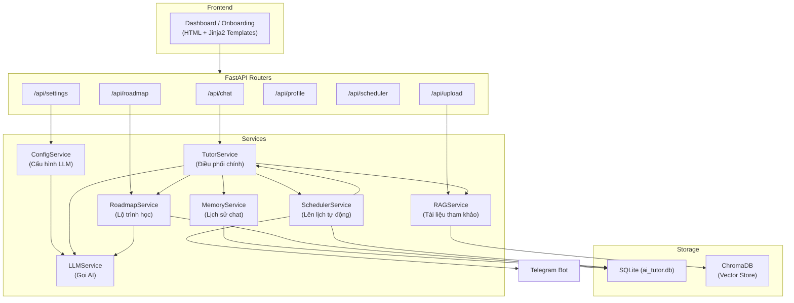
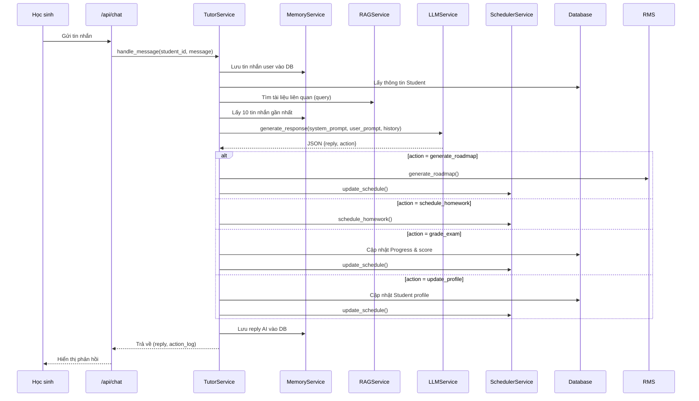
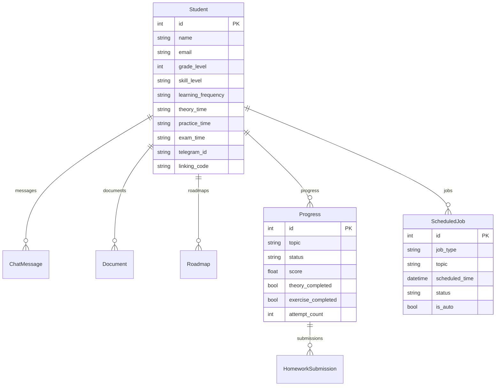

# 📘 AI TUTOR — Tóm Tắt Kiến Trúc & Luồng Hoạt Động

## 1. Sơ Đồ Tổng Quát



---

## 2. Luồng Xử Lý Tin Nhắn Chính



---

## 3. Chi Tiết Các Service

---

### 3.1 LLMService — [llm_service.py](file:///d:/Agent_Tutor/AI_TUTOR/backend/services/llm_service.py)

> **Vai trò:** Lớp trừu tượng gọi các LLM API (Gemini, OpenAI, OpenRouter) với cơ chế fallback tự động.

| Thành phần | Mô tả |
|---|---|
| **Provider hỗ trợ** | `gemini`, `openai`, `openrouter`, `mock` |
| **Cơ chế fallback** | Thử provider chính → lần lượt các provider còn lại → mock |
| **Mock mode** | Trả response giả lập theo keyword (roadmap, schedule, profile, chat) |

**Các method chính:**

| Method | Chức năng |
|---|---|
| `reload_config()` | Đọc lại API keys & model từ env vars. Khởi tạo lại client cho từng provider |
| `generate_response(system_prompt, user_prompt, chat_history)` | Gọi LLM theo thứ tự ưu tiên. Trả về text response |
| `_try_provider(provider, ...)` | Thử 1 provider cụ thể. Trả `None` nếu lỗi |
| `_build_openai_messages(...)` | Build mảng messages theo format OpenAI (dùng chung cho OpenAI & OpenRouter) |
| `get_mock_fallback(...)` | Trả response mock dựa vào keyword trong prompt |

**Cách hoạt động:**
1. `reload_config()` đọc env vars → init client cho mỗi provider có key hợp lệ
2. Khi gọi `generate_response()`: build danh sách provider theo thứ tự ưu tiên
3. Lần lượt gọi `_try_provider()` — provider nào thành công thì dùng luôn
4. Nếu tất cả fail → dùng `get_mock_fallback()` trả response giả lập

---

### 3.2 MemoryService — [memory_service.py](file:///d:/Agent_Tutor/AI_TUTOR/backend/services/memory_service.py)

> **Vai trò:** Quản lý lịch sử hội thoại (short-term memory) giữa học sinh và AI.

| Method | Chức năng |
|---|---|
| `add_message(db, student_id, sender, message)` | Lưu 1 tin nhắn (user/ai) vào bảng `ChatMessage` |
| `get_chat_history(db, student_id, limit=10)` | Lấy N tin nhắn gần nhất, sắp xếp theo thứ tự thời gian tăng dần |

**Cách hoạt động:**
1. Mỗi tin nhắn (cả user lẫn AI) được lưu vào SQLite qua bảng `ChatMessage`
2. Khi cần context cho LLM, lấy 10 tin nhắn gần nhất → format thành `[{role, content}]`
3. Dữ liệu được truyền vào `generate_response()` để LLM có ngữ cảnh hội thoại

---

### 3.3 RAGService — [rag_service.py](file:///d:/Agent_Tutor/AI_TUTOR/backend/services/rag_service.py)

> **Vai trò:** Retrieval-Augmented Generation — lưu trữ và truy vấn tài liệu học tập của học sinh.

| Thành phần | Mô tả |
|---|---|
| **Vector DB** | ChromaDB (persistent) tại `backend/storage/chroma_db` |
| **Fallback** | In-memory dictionary + keyword matching nếu ChromaDB không khả dụng |
| **Chunking** | Chia text thành đoạn 500 từ, overlap 100 từ |
| **Embedding** | `SimpleDummyEmbeddingFunction` — vector 384 chiều (placeholder) |

**Các method chính:**

| Method | Chức năng |
|---|---|
| `get_collection(student_id)` | Lấy/tạo ChromaDB collection riêng cho mỗi student |
| `add_document(student_id, doc_id, filename, content)` | Chunk text → lưu vào ChromaDB (hoặc fallback) |
| `query_documents(student_id, query, limit=4)` | Tìm chunks liên quan nhất. ChromaDB trước, fallback keyword matching sau |
| `clear_student_documents(student_id)` | Xóa toàn bộ dữ liệu RAG của 1 student |
| `_chunk_text(text, chunk_size, overlap)` | Chia văn bản thành các đoạn nhỏ có overlap |

**Cách hoạt động:**
1. Khi upload tài liệu → `add_document()` chunk text → lưu vào ChromaDB collection `student_{id}_docs`
2. Khi chat → `query_documents()` tìm chunks liên quan → đưa vào prompt của LLM làm context bổ sung
3. Nếu ChromaDB lỗi → fallback sang in-memory keyword matching

---

### 3.4 RoadmapService — [roadmap_service.py](file:///d:/Agent_Tutor/AI_TUTOR/backend/services/roadmap_service.py)

> **Vai trò:** Tạo lộ trình học tập tự động bằng LLM, dựa trên thông tin học sinh và tài liệu đã upload.

**Method chính:** `generate_roadmap(db, student_id, subject)`

**Cách hoạt động:**
1. Lấy thông tin học sinh: `skill_level`, `grade_level`, `learning_goals`
2. Đọc nội dung tài liệu đã upload (giới hạn 5000 ký tự/file) làm tham khảo
3. Build prompt yêu cầu LLM tạo **8-10 bài học Toán**, mỗi bài gồm 3 phần:
   - **Lý thuyết** — Đọc và ghi nhớ
   - **Bài tập vận dụng** — 5 câu (không tính điểm lộ trình)
   - **Kiểm tra** — 8 câu (tính điểm, mở khóa unit tiếp theo)
4. LLM trả JSON list `[{title, description, estimated_hours}]`
5. Parse JSON → strip markdown wrappers → validate → lưu vào bảng `Roadmap`
6. Nếu LLM lỗi → dùng fallback roadmap 3 bước cơ bản

---

### 3.5 SchedulerService — [scheduler_service.py](file:///d:/Agent_Tutor/AI_TUTOR/backend/services/scheduler_service.py)

> **Vai trò:** Quản lý lịch học tự động bằng APScheduler. Tự động giao lý thuyết, bài tập, kiểm tra theo lịch cá nhân.

| Thành phần | Mô tả |
|---|---|
| **Engine** | `APScheduler` (AsyncIOScheduler) |
| **Lưu trữ** | Bảng `ScheduledJob` trong SQLite |
| **Job types** | `theory`, `practice`, `exam`, `free_practice` |

**Các method chính:**

| Method | Chức năng |
|---|---|
| `start()` | Khởi động APScheduler + reload các job pending từ DB |
| `schedule_homework(student_id, topic, run_time, ...)` | Tạo 1 job mới: lưu DB + đăng ký APScheduler |
| `update_schedule(student_id)` | **Quan trọng nhất** — Hủy job cũ, tính toán lịch mới dựa trên tần suất học |
| `_trigger_homework_job(student_id, job_id, topic)` | Callback khi job chạy: gọi TutorService tạo nội dung → lưu chat + gửi Telegram |
| `_get_learning_dates(student, start, count, ...)` | Tính danh sách ngày học dựa trên `learning_frequency` |

**Luồng `update_schedule()`:**
1. Hủy tất cả auto-jobs đang pending (DB + APScheduler memory)
2. Lấy roadmap mới nhất → tìm **topic chưa hoàn thành đầu tiên**
3. Kiểm tra `learning_frequency` của student (bắt buộc phải có)
4. Tính ngày học tiếp theo dựa trên tần suất (hàng ngày / cách ngày / theo thứ)
5. Tạo 3 jobs cho topic đó: Theory → Practice → Exam theo `theory_time`, `practice_time`, `exam_time`

**Luồng `_trigger_homework_job()`:**
1. Kiểm tra job còn pending không
2. Đánh dấu status = "sent"
3. Gọi TutorService tương ứng: `generate_theory()`, `generate_practice()`, `generate_exam()`
4. Lưu nội dung vào `ChatMessage`
5. Nếu student có `telegram_id` → gửi qua Telegram Bot

---

### 3.6 TutorService — [tutor_service.py](file:///d:/Agent_Tutor/AI_TUTOR/backend/services/tutor_service.py)

> **Vai trò:** **Service điều phối trung tâm** — xử lý tin nhắn, gọi LLM, parse action, thực thi hành động, tạo nội dung bài học/bài tập/kiểm tra.

**Phụ thuộc:** Sử dụng cả 5 service còn lại (`LLM`, `Memory`, `RAG`, `Roadmap`, `Scheduler`).

#### A. Method chính: `handle_message(db, student_id, message)`

**9 bước xử lý:**

| Bước | Hành động |
|---|---|
| 1 | Lưu tin nhắn user → `MemoryService.add_message()` |
| 2 | Lấy profile student từ DB |
| 3 | Query RAG tìm tài liệu liên quan → thêm vào prompt |
| 4 | Lấy 10 tin nhắn gần nhất từ `MemoryService` |
| 5 | Build **system prompt** với role, profile, action schema |
| 6 | Gọi `LLMService.generate_response()` |
| 7 | Parse JSON response: strip `<think>`, markdown, extract `{reply, action}` |
| 8 | **Thực thi action** (nếu có — xem bảng dưới) |
| 9 | Lưu reply AI → `MemoryService.add_message()` |

#### B. Các Action được hỗ trợ

| Action Type | Mô tả | Ảnh hưởng Roadmap |
|---|---|---|
| `schedule_homework` | Lên lịch bài tập 1 lần | ❌ |
| `generate_roadmap` | Tạo lộ trình → init Progress → update schedule | ✅ |
| `update_profile` | Cập nhật thông tin + lịch học → update schedule | ✅ |
| `grade_exam` | Chấm điểm kiểm tra → lưu score → mở khóa unit (≥5đ) | ✅ |
| `grade_homework` | Chấm điểm bài tập vận dụng (chỉ phản hồi) | ❌ |
| `update_subtask` | Đánh dấu hoàn thành theory/exercise | ✅ |

#### C. Các method tạo nội dung

| Method | Loại nội dung | Số câu | Ghi chú |
|---|---|---|---|
| `generate_theory()` | Bài học lý thuyết | — | Để đọc, không phải bài tập |
| `generate_practice()` | Bài tập vận dụng | 5 câu | Không tính điểm lộ trình |
| `generate_exam()` | Bài kiểm tra | 8 câu | Tính điểm, mở khóa unit |
| `generate_free_practice()` | Bài tập tự do | 3-5 câu | Theo yêu cầu ad-hoc |
| `generate_milestone_report()` | Báo cáo cột mốc | — | Khi hoàn thành mỗi 3 unit |
| `generate_daily_report()` | Báo cáo hàng ngày | — | Tóm tắt hoạt động trong ngày |

---

## 4. Database Models



---

## 5. Khởi Tạo & Liên Kết Service

Thứ tự khởi tạo trong [backend/main.py](file:///d:/Agent_Tutor/AI_TUTOR/backend/main.py):

```
ConfigService.init_llm_config()     ← Load .env + JSON config
    ↓
LLMService()                        ← Đọc env vars, init API clients
MemoryService()                      ← Không dependency
RAGService()                         ← Init ChromaDB
RoadmapService(llm_service)          ← Cần LLM để tạo roadmap
SchedulerService()                   ← Init APScheduler
TutorService(llm, memory, rag, roadmap)  ← Cần tất cả service trên
    ↓
scheduler ↔ tutor (liên kết 2 chiều) ← Tránh circular import
    ↓
global_services.* = ...              ← Registry chia sẻ cho Telegram bot
    ↓
APScheduler.start() + Telegram Bot   ← Trong lifespan event
```

> [!IMPORTANT]
> `SchedulerService` và `TutorService` có **quan hệ 2 chiều**: Scheduler gọi Tutor để tạo nội dung, Tutor gọi Scheduler để lên lịch. Được giải quyết bằng `set_tutor_service()` / `set_scheduler_service()` sau khi khởi tạo.
